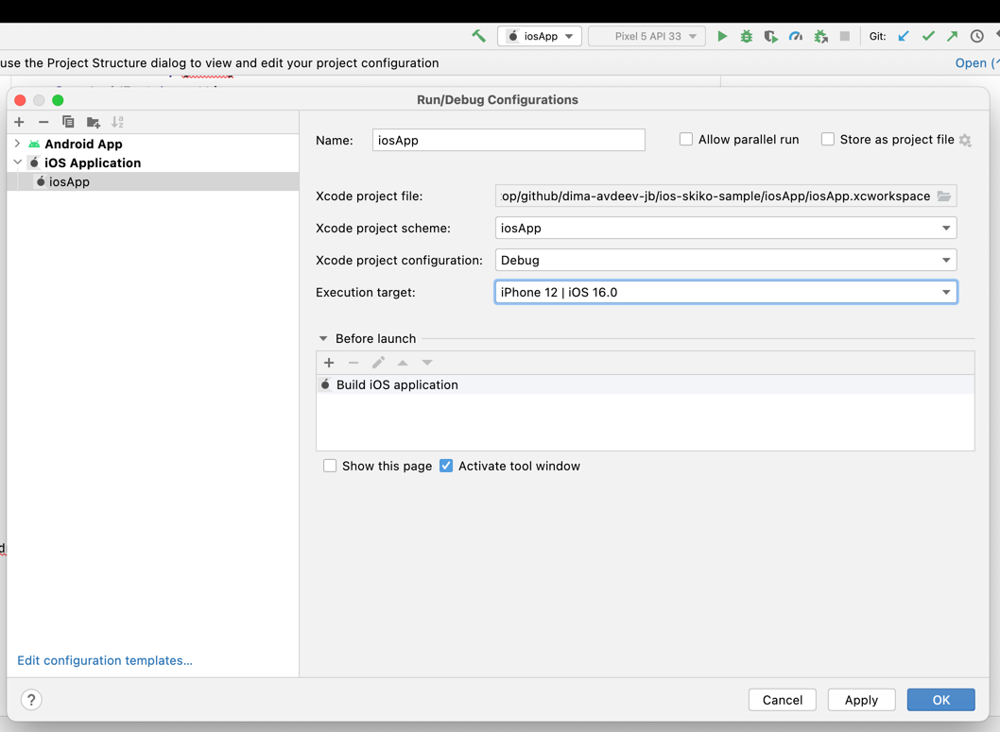

# ios-skiko-sample
 - You need install cocoapods `brew install cocoapods`
 - Use AndroidStudio and install plugin "Kotlin Multiplatform Mobile"
 - Choose iosApp run configuration and go to "Edit configurations..."
 - 
 - Choose your iOS simulator
 - After that you can open Xcode project `open iosApp/iosApp.xcodeproj`
 - Configure Team ID and launch on real device